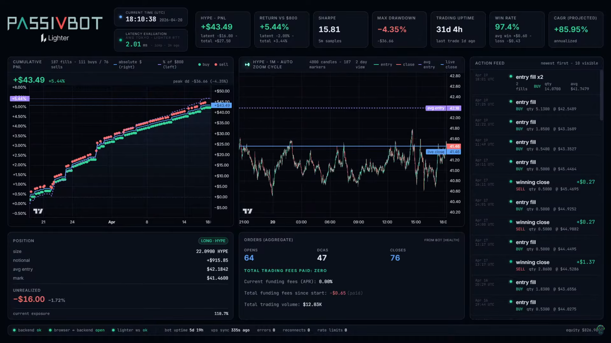

# Lighter HYPE Live Dashboard

Broadcast-ready dashboard for a Passivbot instance running on Lighter and trading `HYPE`.
The repo contains a FastAPI backend, a React frontend, and an OBS-friendly `/stream` route locked to `1920x1080`.

<p align="center">
  
</p>

## What it does

- Pulls fills, health, and position context from a remote Passivbot host over SSH.
- Rebuilds metrics locally in SQLite and enriches them with live Lighter market data.
- Streams state to the frontend over WebSocket for both a regular dashboard and a stream layout.

## Current dashboard features

- Top strip with realized, latent, and total PnL, return vs baseline, Sharpe, max drawdown, trading uptime, win rate, and CAGR.
- Cumulative PnL panel with absolute dollars, percent-of-baseline overlay, and grouped buy/sell markers.
- Live `HYPE` 1m chart with auto-zoom cycling, fill markers, avg-entry line, and live-close line.
- Position panel with size, notional, avg entry, mark, unrealized PnL, and exposure.
- Orders panel with aggregate opens / DCAs / closes, total trading volume, current funding APR, and total funding since start.
- Action feed that groups burst fills and highlights wins, losses, buys, sells, and order events.
- Health footer with backend / browser / Lighter WS status, stale-data banner, current time, and AWS Tokyo -> Lighter RTT.
- Overlay animations for entry, win, loss, order activity, and a "this is fine" crisis animation when unrealized PnL drops below `-$10`.

## Stack

- Backend: Python 3.10+, FastAPI, asyncssh, aiosqlite, httpx, websockets, Pydantic v2
- Frontend: React 18, TypeScript, Vite, Zustand, Framer Motion, TradingView Lightweight Charts, Tailwind
- Persistence: SQLite at `data/dashboard.db` (gitignored)

More detail lives in [`docs/DISCOVERY.md`](docs/DISCOVERY.md), [`docs/STREAMING.md`](docs/STREAMING.md), and [`LIGHTER_DASHBOARD_PLAN.md`](LIGHTER_DASHBOARD_PLAN.md).

## Safe setup

1. Copy `.env.example` to `.env`.
2. Fill in your own `VPS_HOST`, `VPS_USER`, `SSH_KEY_PATH`, and `REMOTE_DIR`.
3. Keep `.env`, YouTube stream keys, private SSH keys, and SQLite files out of git.

Shared defaults in the tracked files are intentionally placeholders so the repo can be pushed safely.

## First-time setup

```bash
# backend
cd backend
python -m venv .venv
.venv/Scripts/python -m pip install -e ".[dev]"    # Windows
# .venv/bin/python -m pip install -e ".[dev]"      # macOS / Linux

# frontend
cd ../frontend
npm install
cd ..
```

## Run locally

Run the services in two terminals:

```bash
# terminal 1
cd backend
.venv/Scripts/python -m uvicorn app.main:app --host 127.0.0.1 --port 8787
```

```bash
# terminal 2
cd frontend
npm run dev -- --host 127.0.0.1 --port 5173
```

Then open:

- Dashboard: `http://127.0.0.1:5173/`
- Stream mode: `http://127.0.0.1:5173/stream`

If you prefer the helper script and have a bash-compatible shell available, you can also run `bash scripts/run_dev.sh`.

## Dev animation demo

With the backend running, you can trigger demo events:

```bash
curl -X POST http://127.0.0.1:8787/api/dev/inject -H "Content-Type: application/json" -d "{\"kind\":\"win\",\"pnl\":1.23}"
curl -X POST http://127.0.0.1:8787/api/dev/inject -H "Content-Type: application/json" -d "{\"kind\":\"loss\",\"pnl\":0.75}"
curl -X POST http://127.0.0.1:8787/api/dev/inject -H "Content-Type: application/json" -d "{\"kind\":\"entry\"}"
curl -X POST http://127.0.0.1:8787/api/dev/inject -H "Content-Type: application/json" -d "{\"kind\":\"order\"}"
```

The crisis overlay is not triggered by the dev endpoint; it appears automatically when the live unrealized PnL crosses the configured drawdown threshold.

## Build and checks

```bash
# frontend
cd frontend
npm run build

# backend
cd ../backend
.venv/Scripts/python -m pytest tests -v
```

## 24/7 stream notes

- `/stream` is the fixed `1920x1080` layout intended for OBS window capture.
- `scripts/run_stream.ps1` launches a kiosk-style Chrome window for the stream view.
- See [`docs/STREAMING.md`](docs/STREAMING.md) for the OBS and YouTube workflow.

## Repo layout

```text
STREAMING_LIVE_PASSIBOT/
|- backend/      FastAPI app, collectors, metrics, persistence, tests
|- frontend/     React app, stream route, panels, animations
|- data/         SQLite db and captured fixtures
|- docs/         discovery and streaming notes
|- scripts/      local run, stream, discovery, and utility scripts
|- infos/        local helper files and gitignored private SSH material
|- screen.png    screenshot used in this README
```
